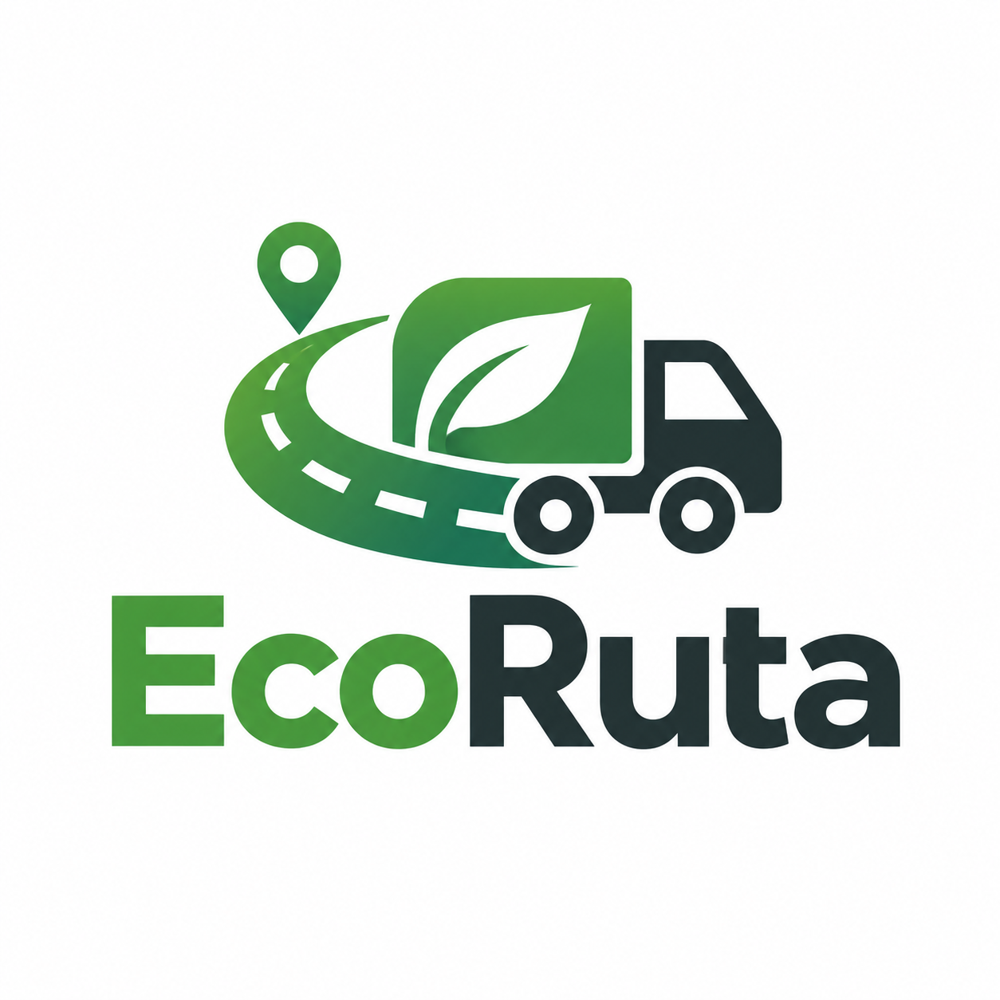

# EcoRuta

EcoRuta conecta transportistas que ya tienen una ruta planificada con pequeñas empresas que necesitan mover carga. Busca aprovechar espacio que de otro modo viajaría vacío y medir el CO2 evitado por cada operación compartida.

El proyecto se apoya en dos ideas propias: matching por capacidad logística real y EcoProof, una evidencia reproducible del ahorro de emisiones.

## Estado actual

**v3** incorpora usuarios y autenticación: registro, login, contraseñas protegidas con bcrypt, JWT y una ruta privada para consultar la sesión actual.

## Puesta en marcha

Requiere Node.js 24 LTS, npm y Docker con Compose. El repositorio no incluye ningún archivo `.env`; si decides usar uno, debes crearlo manualmente.

Variables necesarias:

- `PORT`: puerto de la API. Opcional; por defecto `3000`.
- `DB_HOST`: host de PostgreSQL.
- `DB_PORT`: puerto publicado de PostgreSQL.
- `DB_NAME`: nombre de la base de datos.
- `DB_USER`: usuario de PostgreSQL.
- `DB_PASSWORD`: contraseña de PostgreSQL.
- `JWT_SECRET`: secreto privado de al menos 32 caracteres para firmar tokens.
- `JWT_EXPIRES_SECONDS`: duración del token. Opcional; por defecto `7200`.

Los comandos de desarrollo y ejemplos de autenticación están en `docs/local-development.md`.
